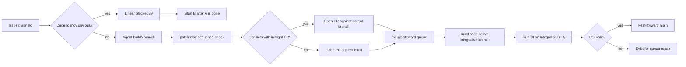

The first version of the patchrelay problem was simple: keep bad PRs from landing. `review-quill` would check the work before merge, patchrelay could send the agent back through a few repair rounds, and `merge-steward` made sure the approved PR was tested against the latest `main` before it landed. Once that loop was working, a different problem showed up: several agents could each produce a reasonable PR, and the PRs could still step on each other.

Starting ten coding agents is the easy demo. The harder part shows up when their branches all come back looking reasonable. CI is mostly green, the diffs look plausible, and the bill arrives at the end: two PRs touched the same migration, one branch was green against yesterday's `main`, a clean rebase quietly dismissed someone's approval. The merge queue ends up being the first place anyone notices the planning was wrong.

Most of the time nothing dramatic happens — most agent PRs don't conflict. I don't want every branch turning into a stack to defend against the ones that do. A stack is just a PR opened against another PR instead of `main`, useful when the dependency is real and noise everywhere else. Keep independent work independent, sequence only the branches with visible coupling.

## The shape

In the current local snapshot, patchrelay has recorded 2,710 runs across 733 issues. Local `merge-steward` databases have seen 1,477 queue entries: 1,306 merged, 166 evicted, 5 dequeued.

The interesting part isn't the volume — it's the ratio. In the `sequence-check` outputs I could classify, 51 finished branches were cleared to open against `main`, and 3 found a stack parent before PR creation. That's the shape I want: most work stays independent, the few branches with real dependencies get sequenced before they race. If half of them needed stacking, the planning would be broken; if none of them ever did, the check would be ornamental.

## The rules

Three places where the system can keep coupled work from racing:

Ordinary planning is the first. If two tasks are obviously dependent, I don't want them racing in GitHub. Patchrelay respects Linear dependencies, so `B blockedBy A` means B doesn't start until A is done. The cheapest conflict is the one that never enters GitHub.

The agent's finished diff is the second. Some conflicts only show up once there's code to compare. Right before PR creation, the workflow runs `patchrelay sequence-check`, which compares the finished branch against in-flight PRs with `git merge-tree`. If another PR is likely to land first and the two branches conflict, the new branch opens against that PR instead of `main`.

The merge queue is the last. `merge-steward` doesn't trust branch CI alone. It builds a speculative integration branch, runs CI on the integrated tree, and only fast-forwards `main` when the tested SHA is still valid — the question it asks isn't "does this PR pass on its own" but "does it still pass in the `main` it's about to land into."

A concrete example: two agents both touch the same generated lock file. Without sequencing, both PRs look reasonable in isolation, and the conflict only shows up when the second one hits the queue. With sequencing, `sequence-check` probes the finished branch against the in-flight PR, sees the real merge conflict, and recommends opening the second PR against the first PR's branch. The queue then validates parent and child in order, instead of letting the second branch become an avoidable repair loop.

## Change identity

The last rule is about identity. GitHub ties review state to a commit SHA, but a SHA isn't a change. I kept seeing clean rebases produce new SHAs with the same diff, and the system would want another full review. That felt like fake work.

`patch-id` is where this lives. `review-quill` computes `git patch-id --stable` for the PR diff. If a new head has the same patch-id as a previously approved attempt, it carries the approval forward onto the new head.

Patch-id doesn't prevent bad planning, prove that two branches compose, or validate the product. It only kills one specific kind of fake work: reviewing the same approved diff twice. The rollout is young — `review-quill` has computed patch-id for 1,564 attempts, and 42 had a prior approval with the same patch-id. All 42 were carried forward. That isn't a giant throughput number; it's a correctness rule.

---

Don't race when you can sequence. Dependencies prevent the obvious races. Sequence-check catches finished branches that should be stacks. The merge queue tests the integrated tree instead of trusting isolated branch CI. Patch-id keeps rebases from becoming review churn. The early result looks healthy because the interventions are rare but nonzero: most branches stay independent, a few become stacks, repeat reviews disappear when the approved diff is literally the same. None of this proves the product is right. It just keeps the factory from manufacturing its own chaos while the real validation problem stays open.
