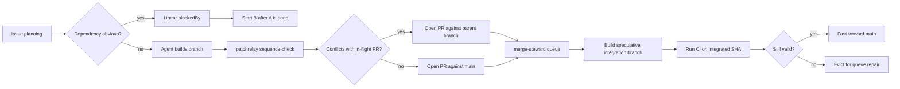

Every `review-quill` round on a PR costs me wall-clock seconds and a few thousand tokens. Multiply by ten or fifteen rounds in a stubborn review-fix loop, by hundreds of issues a month, and the bill stops being a rounding error. The cheap reviews are the ones I don't run.

There are two patterns where the system used to pay for the same review twice. The first is parallel agents whose PRs should have been sequenced — two branches racing each other into the queue, the second one then needing a full repair loop because the first changed `main` underneath it. The second is clean rebases that produce a new SHA against fresh `main` without changing the diff one line, and GitHub correctly invalidates the previous approval. Both are fake work. Both are avoidable.

The factory has separate answers for the two cases. Planning prevents the first. Identity-by-diff prevents the second.

## Plan properly: avoidable conflicts

Most parallel-agent PRs don't conflict and can land in any order. The interesting question is which few do, and how the system notices before the queue. Three checkpoints, in order of cost:

**Ordinary planning** is the cheapest. If two tasks are obviously dependent, patchrelay respects Linear `blockedBy`, so `B blockedBy A` means B doesn't start until A is done. The cheapest conflict is the one that never enters GitHub.

**Sequence-check** catches the conflicts that only show up once there's code to compare. Right before PR creation, patchrelay runs `sequence-check`, which compares the finished branch against in-flight PRs with `git merge-tree`. If another PR is likely to land first and the two branches conflict, the new branch opens against that PR instead of `main`.

**The merge queue** is the last line. `merge-steward` doesn't trust branch CI alone — it builds a speculative integration branch, runs CI on the integrated tree, and only fast-forwards `main` when the tested SHA is still valid. The question it answers isn't "does this PR pass on its own" but "does it still pass in the `main` it's about to land into."

The three are independent and most of the time none of them trigger — most PRs really don't conflict. The cost only shows up when one catches a real coupling, and the cost then is a stack or a queue repair instead of a multi-round review-fix on a second PR that didn't see the first coming.

## Carry the approval: trivial rebases

GitHub ties review state to a commit SHA. A SHA isn't a change. A clean rebase against fresh `main` produces a new SHA with the same diff, and GitHub correctly invalidates the previous approval — which sends the PR back through `review-quill` for a fresh look at a change that hasn't changed.

That's where `patch-id` fits. `review-quill` computes `git patch-id --stable` for the PR diff. If a new head has the same patch-id as a previously approved attempt, the approval carries forward instead of running another review. Same diff, same verdict.

Patch-id doesn't prevent bad planning, prove that two branches compose, or validate the product. It only kills one specific kind of fake work: reviewing the same approved diff twice.

## The numbers

In the current snapshot, patchrelay has recorded 2,710 runs across 733 issues. Local `merge-steward` databases have seen 1,477 queue entries: 1,306 merged, 166 evicted, 5 dequeued.

For the planning side, the classifiable `sequence-check` outputs show 51 finished branches cleared to open against `main` and 3 that found a stack parent before PR creation. Rare but nonzero — exactly the shape I want. If half of them needed stacking, planning would be broken; if none ever did, the check would be ornamental.

For the carry-over side, `review-quill` has computed patch-id for 1,564 attempts. Of those, 42 had a prior approval at the same patch-id and were carried forward. Not a giant throughput number, but each one is a review attempt I didn't pay for.

## Close

Neither half proves the product is right. They keep the factory from manufacturing its own chaos: plan to avoid the collisions that would force a fresh review, carry approvals through the rebases that aren't really new changes. The principle is small. Don't review the same change twice.
