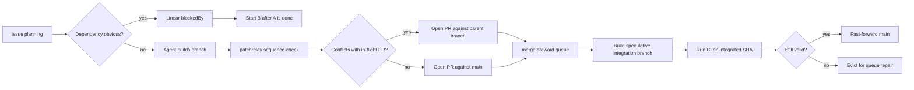

At first, the PatchRelay problem was simple: make sure bad PRs do not land. `review-quill` checked the work before merge, and PatchRelay could send the agent back through a few repair rounds until the found issues were fixed. `merge-steward` made sure an approved PR was tested against the latest `main` tip before it landed. Once that independent review-and-repair loop was working, a different problem showed up: several agents could each produce a reasonable PR, but those PRs could still interfere with each other.

Starting ten coding agents is the easy demo. The harder part begins when their branches all come back looking reasonable. CI is mostly green, the diffs look plausible, and then the cost appears at the end: two PRs touched the same migration, one branch was green against yesterday's `main`, a clean rebase dismissed an approval. The merge queue becomes the first place where planning mistakes are visible.

Most of the time, nothing dramatic happens. Most agent PRs do not conflict. That matters for the design: this should not turn every branch into a stack. A stack is just a PR opened against another PR instead of `main`; it is useful when the dependency is real, and noise everywhere else.

The general pattern is: keep independent work independent, and sequence only the branches with visible coupling.

## The Shape

The data I have so far points in that direction. In the current local snapshot, PatchRelay has recorded 2,710 runs across 733 issues. Local `merge-steward` databases have seen 1,477 queue entries: 1,306 merged, 166 evicted, and 5 dequeued.

The interesting part is not the absolute volume. It is the ratio. In the `sequence-check` outputs I could classify, I found 51 clear recommendations to open a finished branch against `main`, and 3 clear cases where it found a stack parent before PR creation. That is the shape I want: most work remains independent, while the few branches with visible dependencies are sequenced before they race.

If half of the branches needed stacking, planning would be broken. If none of them ever needed stacking, the check would be ornamental. Rare intervention is the point.

## The Rules

The system has three chances to keep coupled work from racing:

The first chance is ordinary planning. If two tasks are obviously dependent, I do not want them racing in GitHub. PatchRelay respects Linear dependencies, so `B blockedBy A` means B does not start until A is done. The cheapest conflict is the one that never enters GitHub.

The second chance happens after an agent has produced a real diff. Some conflicts are only visible once there is code to compare. Right before PR creation, the workflow runs `patchrelay sequence-check`. It compares the finished branch against in-flight PRs with `git merge-tree`. If another PR is likely to land first and the two branches conflict, the new branch opens against that PR instead of `main`.

The last chance belongs to the merge queue. `merge-steward` does not trust branch CI alone. It builds a speculative integration branch, runs CI on that integrated tree, and only fast-forwards `main` when the tested SHA is still valid. Branch CI says "this PR works by itself." Speculative CI says "this PR works in the world it is about to enter."

For a concrete example, imagine two agents both touch the same generated lock file. Without sequencing, both PRs may look reasonable in isolation, and the conflict only becomes obvious when the second one reaches the queue. With sequencing, `sequence-check` probes the finished branch against the in-flight PR, sees the real merge conflict, and recommends opening the second PR against the first PR's branch. The queue then validates the parent and the child in order, instead of turning the second branch into an avoidable repair loop.

## Change Identity

The last rule is about identity. GitHub review state is tied to a commit SHA, but a commit SHA is not the same thing as a change. I kept seeing clean rebases produce new SHAs with the same diff, and then the system wanted another full review. That felt like fake work.

That is where `patch-id` fits. `review-quill` computes `git patch-id --stable` for the PR diff. If a new head has the same patch-id as a previously approved attempt, it can carry the approval forward onto the new head.

This is only part of the problem. Patch-id does not prevent bad planning, prove that two branches compose, or validate the product. It only prevents one specific kind of fake work: reviewing the same approved diff twice.

The rollout is still young. In my current database, `review-quill` has computed patch-id for 1,564 attempts. Only 42 attempts had a prior approval for the same PR and the same patch-id. All 42 were carried forward. That is not a giant throughput number. It is a correctness rule: same approved patch, no repeat review.

The broader pattern is simple: do not race when you can sequence. Dependencies prevent obvious races. Sequence-check catches finished branches that should become stacks. The merge queue tests the integrated tree instead of trusting isolated branch CI. Patch-id keeps rebases from becoming review churn. The early result looks healthy because the interventions are rare but nonzero: most branches stay independent, a few become stacks, and repeat reviews disappear when the approved diff is literally the same.

None of these rules proves the product is right. They only keep the factory from manufacturing its own chaos while the real validation problem remains open.
