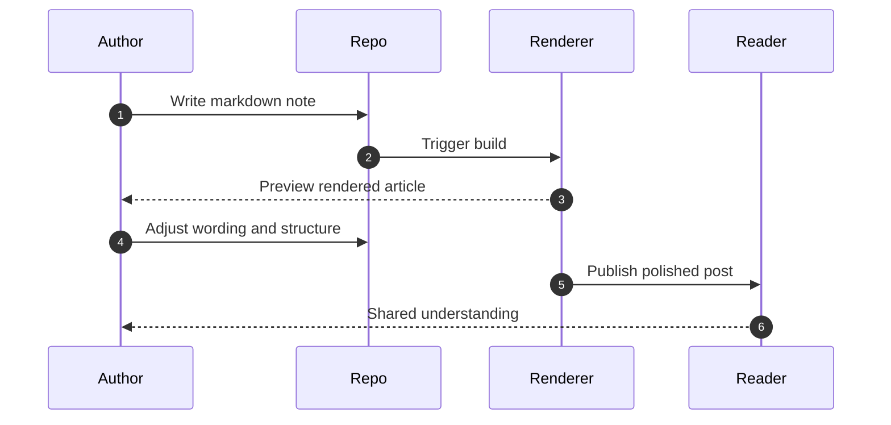
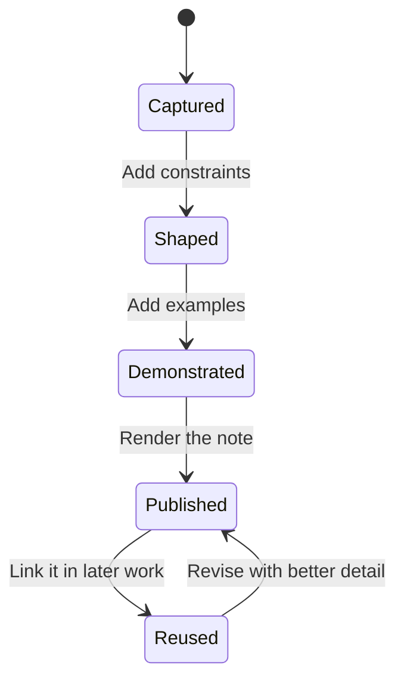
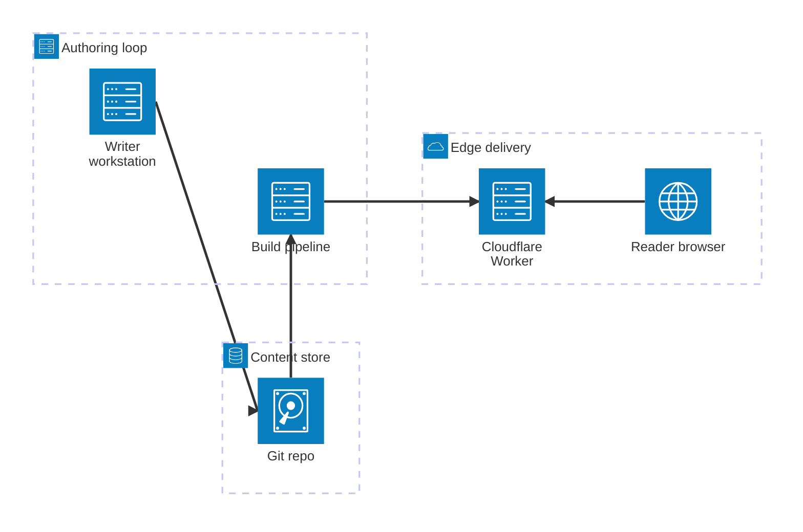

This is the first real post shape for the blog.

It has a simple job: show how writing works here while still sounding like a real note about the software factory. If this page reads well, then the format is doing its job.

## Why start with a formatting post

I want the source of every post to stay plain and durable:

- markdown for prose
- fenced code blocks for examples
- Mermaid for diagrams
- frontmatter for metadata

That keeps the blog close to the way I already think and work. The post file remains readable before it is rendered and easy to evolve over time.

## A minimal note can still be structured

When I write about the software factory, I usually want to move from idea to shape to execution.

> An idea becomes useful when the system gives it a path.

That path does not need to be complicated. It just needs to be legible.

## Example source pattern

Here is the kind of markdown fragment I want to be able to write quickly:

```md
## Outcome
Make the next step obvious.

## Constraints
- Keep the source static.
- Make diagrams easy to embed.
```

That is enough to carry intent without introducing ceremony.

## Diagram examples

This blog also supports Mermaid, which is useful when a software-factory note needs to show flow, handoff, or state instead of describing everything in paragraphs.

### 1. Flow of a note through the system


This is the simplest and most common kind of diagram I expect to use: one thing becoming the next thing.

### 2. Review loop between author and publishing surface



This is useful when the important thing is not just the shape of the system, but the order in which the system responds.

### 3. State of an idea before it becomes useful



This kind of diagram works well when a post is really about maturity: what an idea is before it is operational, and what changes as it becomes reusable.

### 4. Architecture view of a tiny publishing factory



This is the most useful “advanced” style for the blog. It lets a post show groups, infrastructure, and boundaries without turning into a full architecture document.

## Table example

Sometimes the shortest explanation is a table.

| Layer | Format | Why it exists |
| --- | --- | --- |
| Source | Markdown | Easy to write and review |
| Structure | Frontmatter | Gives the post metadata |
| Diagram | Mermaid | Shows system flow clearly |
| Output | HTML | Makes the note pleasant to read |

## A small code example

Even a blog about delivery systems should be able to carry a small executable idea:

```ts
type FactoryNote = {
  title: string;
  markdown: string;
  publishedAt: string;
};
```

That is really the whole point of this page. The format should disappear behind the writing, while still being strong enough to carry technical content cleanly.

## What comes next

The later posts will be mine and they will be specific. This one simply proves that the publishing surface is ready:

1. Write in markdown.
2. Add code or diagrams when they help.
3. Publish a readable note without touching a CMS.
