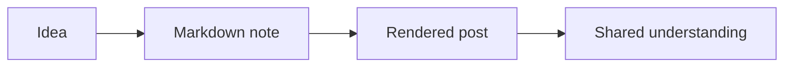
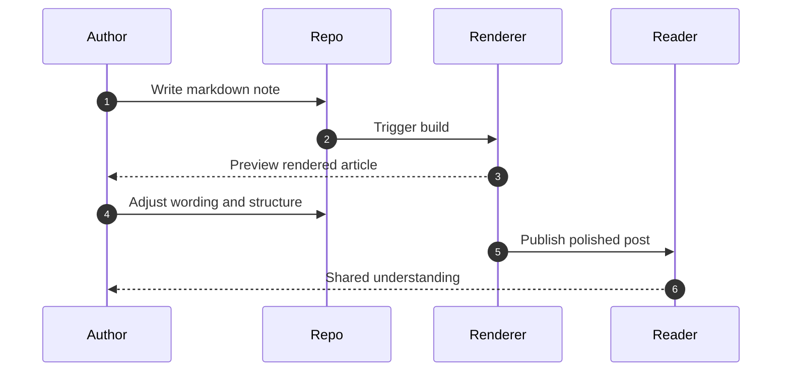
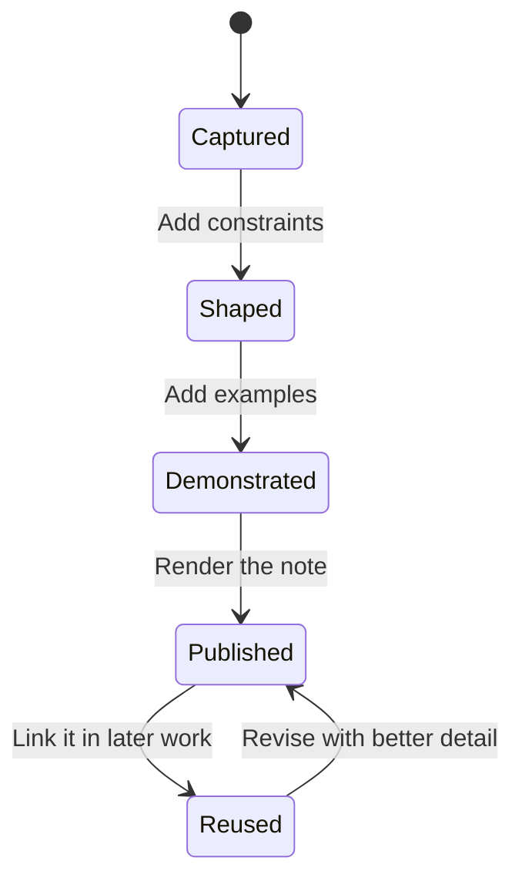
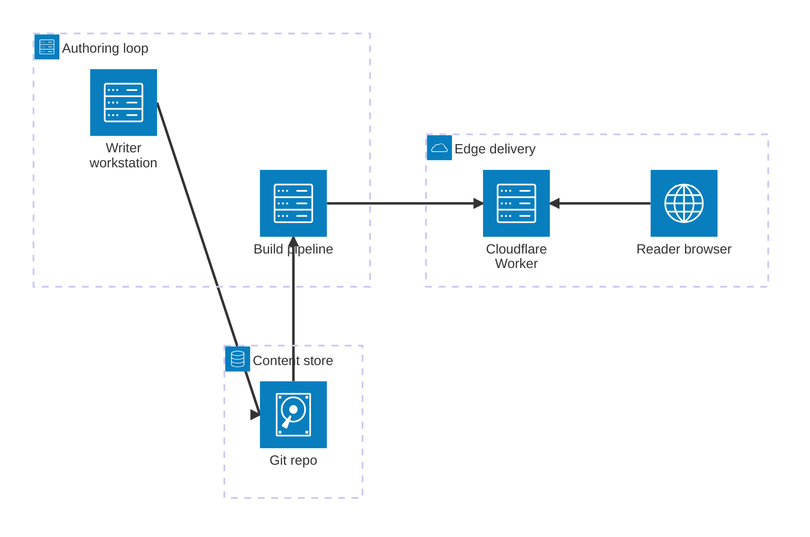

This is the first post, and its only job is to prove the format can carry technical content cleanly — markdown for prose, code for examples, Mermaid for diagrams, frontmatter for metadata. No CMS, nothing proprietary, nothing that'll be painful to migrate in two years.

## A minimal note can still be structured

When I write about the software factory, I want to move from idea to shape to execution.

> An idea becomes useful when the system gives it a path.

The path doesn't need to be complicated. It just needs to be legible.

## Example source pattern

The kind of fragment I want to write quickly:

```md
## Outcome
Make the next step obvious.

## Constraints
- Keep the source static.
- Make diagrams easy to embed.
```

That's enough to carry intent without ceremony.

## Diagram examples

Mermaid is useful when a note needs to show flow, hand-off, or state instead of describing everything in paragraphs.

### 1. Flow of a note through the system


```mermaid
flowchart LR
  A[Idea] --> B[Markdown note]
  B --> C[Rendered post]
  C --> D[Shared understanding]
```

The simplest kind: one thing becoming the next thing.

### 2. Review loop between author and publishing surface


```mermaid
sequenceDiagram
  autonumber
  participant Author
  participant Repo
  participant Renderer
  participant Reader

  Author->>Repo: Write markdown note
  Repo->>Renderer: Trigger build
  Renderer-->>Author: Preview rendered article
  Author->>Repo: Adjust wording and structure
  Renderer->>Reader: Publish polished post
  Reader-->>Author: Shared understanding
```

Useful when the order of responses matters more than the shape.

### 3. State of an idea before it becomes useful


```mermaid
stateDiagram-v2
  [*] --> Captured
  Captured --> Shaped: Add constraints
  Shaped --> Demonstrated: Add examples
  Demonstrated --> Published: Render the note
  Published --> Reused: Link it in later work
  Reused --> Published: Revise with better detail
```

Works well when a post is really about maturity — what an idea is before it's operational, and what changes as it becomes reusable.

### 4. Architecture view of a tiny publishing factory


```mermaid
architecture-beta
  group edge(cloud)[Edge delivery]
  group authoring(server)[Authoring loop]
  group content(database)[Content store]

  service writer(server)[Writer workstation] in authoring
  service git(disk)[Git repo] in content
  service build(server)[Build pipeline] in authoring
  service worker(server)[Cloudflare Worker] in edge
  service reader(internet)[Reader browser] in edge

  writer:R --> L:git
  git:T --> B:build
  build:R --> L:worker
  reader:L --> R:worker
```

This is the most useful "advanced" style for the blog. It lets a post show groups, infrastructure, and boundaries without turning into a full architecture document.

## Table example

Sometimes the shortest explanation is a table.

| Layer | Format | Why it exists |
|-|-|-|
| Source | Markdown | Easy to write and review |
| Structure | Frontmatter | Gives the post metadata |
| Diagram | Mermaid | Shows system flow clearly |
| Output | HTML | Makes the note pleasant to read |

## A small code example

Even a blog about delivery systems should be able to carry a small executable idea:

```ts
type FactoryNote = {
  title: string;
  markdown: string;
  publishedAt: string;
};
```

The format should disappear behind the writing, while still being strong enough to carry technical content cleanly. That's the whole point of this page.
