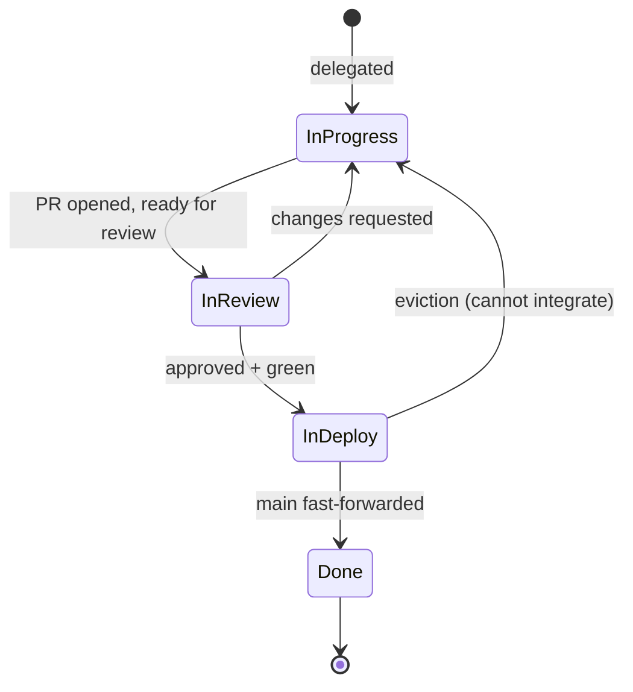

## The shape of the waste

Some time in mid-April I watched patchrelay rebase an already-approved PR onto fresh `main`, dismiss its own approval, and re-enter review. The diff did not change. The code did not change. The branch had a new SHA, and that was enough for default branch protection to drop the approval and for review-quill to wake up and re-read the same change end-to-end.

It was not an isolated bug. Across the runs I sampled (Linear issues `LSR-272`, `LSR-278`, `LSR-279`, `LSR-281`, `LSR-284`) the same five shapes of work kept appearing where they should not have:

- A reviewer re-reviewing a PR after a trivial rebase. Same diff, same approval, fresh model run.
- patchrelay rebasing an already-approved branch onto fresh main, dismissing its own approval, opening another review round.
- A `ci_repair` run firing while the issue was already in the merge queue, chasing a flake on the PR head that the speculative SHA would not even hit.
- An author run finishing with a cosmetic push (comment tweak, test wording) onto an approved head, and watching the approval drop.
- A lock-file conflict between two parallel PRs, caught only when the second one reached the queue and evicted, twenty minutes after either could have been steered around the other.

None of these were bugs in any single service. patchrelay, review-quill, and merge-steward each did the thing they were built to do. The waste happened in the gaps where the services disagreed about *what they were operating on*.

## What we were calling "a PR"

A `git push` to a feature branch produces a ref. The reviewer reads that ref. The merge queue pulls from that ref. We call the whole thing "a PR".

But "the same PR" can mean two completely different things from one push to the next:

- a rebase of the same change onto fresher main → same logical change, different commit graph
- an amended commit with a typo fix in the message → same logical change, different SHA
- a fix-up that addresses a review comment → different change, same PR

The reviewer cared about whether the *change* had changed. The author cared about whether the diff was right. The merge queue cared about whether `main + diff` would compile. None of them were wrong; each was looking at a different artifact, and the public name "PR" lumped them together.

That conflation was producing every shape of waste in the list. The fix was not more orchestration glue between the three services. It was a sharper picture of what each was actually operating on.

## The landscape

Most of this is solved territory. I had been ignoring it because I did not need it until I had three services in production at once.

[Gerrit](https://www.gerritcodereview.com/) has had `patch-id` since the late 2000s. A patch-set is the unit of review; trivial rebases are detected by patch identity and do not reset votes. The model is older than my career and is still the cleanest description of "same change."

[Graphite](https://graphite.dev/) ships a stack-aware review and merge product on top of GitHub. The interesting shape is not the CLI; it is that the chain between PRs is expressed entirely through a base-ref and a tracking comment. No new server-side concept, no "stack id". The chain emerges from primitives GitHub already exposes.

[Bors-NG](https://github.com/bors-ng/bors-ng) builds a staging branch on top of `main`, runs CI on it, and fast-forwards on green. It is the open-source ancestor of every modern merge queue. The thing I needed to internalise was that the staging branch is not a side effect; it *is* the integration. The PR head is incidental.

GitHub's native merge queue and GitLab merge trains are the same idea, dressed differently. GitHub builds a merge-group ref and tests it speculatively. GitLab runs parallel pipelines on a train and evicts on failure. The shape underneath is "test the thing that will land, not the thing that was pushed."

The piece I had to add for myself was not another implementation. It was the realization that all of these tools agree on the same picture of a change, and that my own services would stop fighting each other once I made them agree too.

## Four primitives

The model rests on four ideas Git already gives you. Naming them was most of the work.

**A commit is a tree plus a parent.** Git stores snapshots, not diffs. Every commit points to a tree (the full state of the repo at that moment) and to one or more parents. The diff a reviewer reads is computed: `tree(child) − tree(parent)`. It is a derived view, not the artifact.

**The integration tree.** When your branch lands on main, the result is a new tree: main plus your change, woven together. That tree exists whether you have built it or not.

```
git merge-tree --write-tree main pr-head
→ <tree-id>
```

No working directory, no merge commit, no side effects. Pure function: `(main, head) → tree`. A non-zero exit is the conflict signal. This is what the merge queue should test. This is what main will fast-forward to.

**`patch-id` — the identity of a change.** Two commits represent the same change when the diff they produce against their merge-base is identical:

```
git diff $(git merge-base main HEAD)..HEAD | git patch-id --stable
→ a1b2c3d4… <sha>
```

Same `patch-id`, same change. Even after rebase, amend, cherry-pick, or reorder. What it ignores on purpose: commit messages, author, dates, parent SHAs, the base branch. What changes it on purpose: the diff itself, including conflict resolutions. (`--stable` canonicalises per-file ordering so a reorder within a range does not change the id; bare `git patch-id` does not.)

**Landing is a pointer move.** If main is an ancestor of some commit C, and C has been tested in the form it will land in, then "merging" is just `git push origin C:main`. Atomic. Cheap. No merge button, no new commit on top. The integration work happens before the pointer moves; by the time main advances, there is nothing left to test.

> *Main is a tag. We move it through commits we trust.*

## Three roles, four states

Once the primitives are named, the rest collapses into a small picture.

There are three roles operating on a PR. Each can be replaced by a different actor without changing the shape:

|Role|Default|Replaceable by|
|-|-|-|
|Author|patchrelay|A human, Cursor, Claude Code, Codex CLI|
|Reviewer|review-quill|Copilot Code Review, CodeRabbit, a human|
|Lander|merge-steward|Mergify, Aviator, Bors, GitHub native MQ|

They never call each other. They communicate through five GitHub artifacts: the PR ref, the spec branch, the approval, the eviction `check_run`, and the `queued-for-deploy` label. All five names are configurable per project; the defaults preserve the names the three services already used.

The roles map directly onto four Linear states the team already had:



In Progress is the Author producing or revising the change. In Review is the Reviewer's verdict and required branch checks working until both green. In Deploy is the Lander holding the issue while it builds the spec, runs CI on it, and waits to fast-forward main. Done is `main` fast-forwarded to the tested SHA.

Two ways back to In Progress: the Reviewer asks for changes, or the Lander cannot integrate. If a project's Linear workflow does not include In Deploy, the issue stays in In Review with a `queued-for-deploy` label; the harness never invents a workflow state that does not exist.

## The rules that fall out

With the model written down, the five waste classes from the transcripts had named fixes:

|Observed waste|Rule that eliminates it|
|-|-|
|Re-review on rebase|Reviewer carries the verdict by `patch_id`. Same change, same approval.|
|Chase-rebase loop on approved PRs|Author rule: do not originate a `patch-id`-equivalent push. The Lander handles base advance; the Author should not republish just because main moved.|
|`ci_repair` during In Deploy on flaky branch CI|Eviction rule: branch CI is metadata once In Deploy. The only signal that returns the issue to In Progress is the `merge-steward/queue` check_run.|
|Cosmetic re-push dismissing fresh approval|Mid-run approval cancellation. A run is superseded if its source SHA is approved while the run is still in flight; the finalizer blocks the redundant push.|
|Lock-file conflicts caught at integration time|Tier-1 (`blockedBy` at planning) and Tier-2 (`patchrelay sequence-check` at handoff) sequencing. Tier-3 (eviction loop) stays as the safety net.|

Each of these was already what the right thing to do looked like, in the abstract. The model just made it possible to write it down once and have all three services agree.

The shipped work that came out of formalizing the model was small. The biggest single piece was carry-forward in review-quill (`db55d68 docs(review-quill): document carry-forward, integration_tree mode, no-cache label`, on top of the runtime work that made the cache key real). The runner-up was patch-id-aware updateHead in merge-steward (`90ebb71 docs(merge-steward): document spec-ready, patch-id-aware updateHead, stack-aware admission`): same change, no eviction, no requeue. Sequence-check and mid-run approval cancellation rounded it out. None of them are big features. They are the smallest set of behaviours that lets the three services hold the same picture.

The doc that holds the picture is `docs/concepts.md` (`5c22ae4 docs(concepts): introduce shared mental model`). It is now the first thing a new contributor or a new agent reads, and every doc in the stack uses the same vocabulary as that one.

## What I would revisit

There are two pieces I am not finished with.

The first is the review surface. By default review-quill reads the PR head's diff, Gerrit-style, and keys verdicts on `patch_id` alone. There is an opt-in `integration_tree` mode that reads the synthetic merged tree and keys on `(patch_id, integration_tree_id)`, which catches semantic merge issues at review time instead of at queue time. The trade-off is more re-reviews; I am running it on one repo to see whether the trade-off is worth it. The default is the cheaper option and may stay that way.

The second is stacks. There is no "Stack object" in the factory. The chain is expressed through a Linear `blockedBy` edge and a PR `base` ref, and that is the entire contract. That works as long as stacks stay shallow (two or three rungs). If the planner starts producing five-deep stacks, the lack of a first-class chain-aware admission policy will start to bite, and the part of the model that says "no new vocabulary" will earn its first scar.

None of these primitives are mine. Gerrit had `patch-id` two decades ago. Bors had the staging-branch idea before me. Graphite had the no-Stack-object discipline. The thing this post is reporting is the smallest reading of those primitives that makes three services running side by side stop disagreeing about what they are looking at.

## Related

- [patchrelay: a Linear-driven harness for Codex](/posts/patchrelay)
- [merge-steward: a self-hosted merge queue without the Enterprise gate](/posts/merge-steward)
- [review-quill: a strict reviewer for your coding agent](/posts/review-quill)
